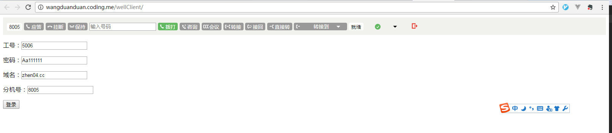
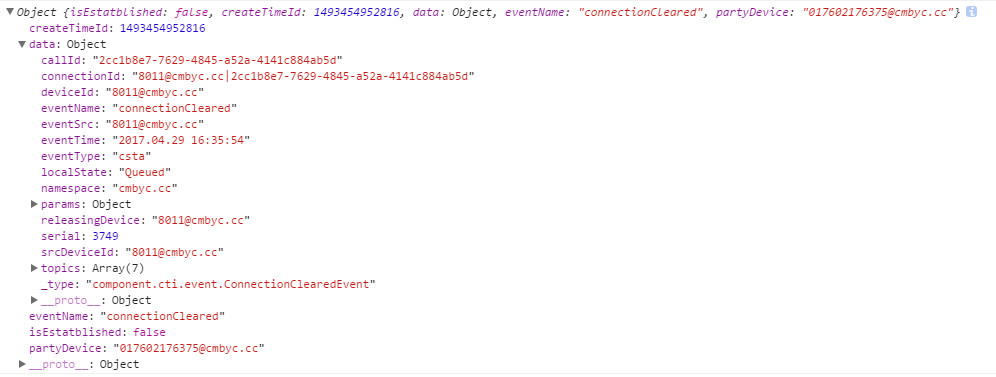
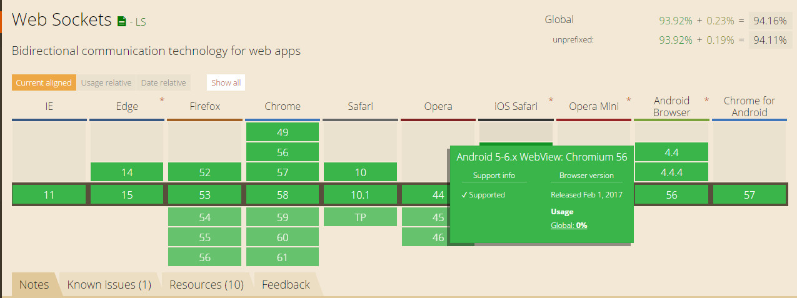

[TOC]

## 注意事项
1. 不经本人同意，请不要修改well-client.js, well-client-ui.js的任何代码。擅自修改源代码，很可能导致意外的问题。
2. 请使用在`wellClient`方法说明中含有的方法，使用没有说明文档的方法，并不能保证这些方法的功能稳定性。

## 0 运行项目  or  [在线的demo](https://wangduanduan.github.io/wellclient/)
直接用浏览器打开根目录下的index.html。或者你也可以访问


然后在浏览器里打开： 可以看到如下basic分支的界面。



## 1 环境要求
### 1.1 硬件要求
软电话使用浏览器原生的WebSocket来接收事件，因此浏览器必须支持原生的WebSocket。所以对浏览器版本要求如下。

 - IE >= 10
 - 谷歌浏览器 >= 49
 - FireFox >= 54
 - Edge >= 14

### 1.2 软件要求
- jQuery >= 1.11.3

### 1.3 引入JS文件
`请不要在以下的js里修改任何代码，或者将自己的业务逻辑添加在里面`

- 【必须】`stomp.min.js`: 解析stomp协议
- 【必须】`well-client.js`： 软电话核心文件
- 【可选】`well-client-ui.js`： 软电话UI层逻辑处理，如果你只需要调用软电话的接口，不需要软电话自带的UI的话，这个JS文件是不需要引入的
- 【废弃】`websocket-support.min.js`: 最早的集成中引入了这个文件，但是由于其中存在一些无法修复的问题，所以废弃

综上，在你HTML的头部可能是这个样子。
```
<head>
  <meta charset="utf-8">
  <title>wellClient 软电话</title>
  <link rel="stylesheet" href="public/css/well-client.css">
  <script src="public/js/jquery-1.11.3.min.js"></script>
  <script src="public/js/stomp.min.js"></script>
  <script src="public/js/well-client.js"></script>
  <script src="public/js/well-client-ui.js"></script>
</head>
```

当然，`我强烈建议您使用我们提供的云端的js文件`, 只需要修改头部信息如下。
```
// 假如我们将js文件放在www.demo.com的域名下的话
<head>
  <meta charset="utf-8">
  <title>wellClient 软电话</title>
  <link rel="stylesheet" href="public/css/well-client.css">
  <script src="public/js/jquery-1.11.3.min.js"></script>
  <script src="public/js/stomp.min.js"></script>
  <script src="https://www.demo.com/public/js/well-client.js"></script>
  <script src="https://www.demo.com/public/js/well-client-ui.js"></script>
</head>
```

### 1.4 配置
由于软电话可以连接不同的服务端，所以在调用任何接口之前，必须先要配置一次。当然了，每次刷新页面后，都是需要再次配置一次的。配置的方法很简单。示例如下：

```
// 可以在页面的js文件加载完成后，执行下面的函数
wellClient.useConfig('CMB-PRD2');
```
wellClient.useConfig(envName): 使用配置

envName | 使用范围
--- | ---
CMB-PRO | cmb生产环境
CMB-DEV | cmb开发环境和测试环境
AWS-PRO | AWS环境 | 使用aws环境的配置
CMB-PRO2 |prd2生产环境

### 1.5 登录
```
// 订阅单个事件
wellClient.on('agentLoggedOn',function(event){
    console.log('此时真正登录成功');
});

// 订阅所有事件
wellClient.exports = function(event){
    console.log('receive event: >>>');
    console.log(event.eventName);
};


wellClient.agentLogin({
  jobNumber: '5001',
  password: '123456',
  domain: 'test.cc',
  ext: '8001',
  loginMode: 'ask',
  agentMode: 'Ready'
})
.done(function(res){
// 注意： 登录请求成功并不意味登录成功，收到agentLoggedOn事件后才算登录成功
  console.log('登录请求成功');
})
.fail(function(res){
  console.log('登录请求失败');
});
```

### 1.6 调试
默认情况下，软电话收到的事件是不会打印到控制台的，如果你想把所有的事件在收到时都可以在控制台打印，可以使用一下方式。
```
wellClient.setConfig({
    useWsLog: true
})
```


## 2 wellClient方法说明
### 2.1 wellClient.useConfig(envName): 使用配置

参数 | 类型 | 是否必须 |  默认值 | 描述
---|---|---|---|---
envName | string | 是 | 无 | 使用某个环境的配置。


envName | 使用范围 | 说明
--- | --- | ---
CMB-PRO | cmb生产环境 | 使用生产的配置, 并且默认的域名会被设置成cmb.cc
CMB-DEV | cmb开发环境和测试环境 | 使用测试和生产的环境，并且默认域名会被设置成cmbyc.cc
AWS-PRO | AWS环境 | 使用aws环境的配置

### 2.1 wellClient.setConfig(config)：设置配置信息

config是js对象，具有以下字段

参数 | 类型 | 是否必须 |  默认值 | 描述
---|---|---|---|---
debug | boolean | 否 | false | debug模式会写详细的日志信息，设置成false可以关闭日志
useWsLog | boolean | 否 | false | 是否输出详细的websocket信息
clickCallClass | string | 否 | well-canBeCalled | 设置点击呼叫的类,例如某个span标签包裹一串数字“8001sd12”,当这个类被点击的时候，
autoAnswer | boolean | 否 | true | 自动接听默认为true。即当有电话呼入时，软电话会自动接听这个电话。设置为false时，需要手动点击接听按钮才能接听。
useErrorAlert | boolean | 否 | true | 是否使用alert弹出错误信息，例如在登录时候，出现错误。默认会使用友好的提示信息告知座席。例如：座席5003已在分机：8004上登录。
如果你想自己处理登录的各种错误，你需要把这一样设置为false.

`Example`

```
wellClient.setConfig({debug:false});
```


### 2.2 wellClient.agentLogin(agent): 座席登录
参数 | 类型 | 是否必须 |  默认值 | 描述
---|---|---|---|---
agent.jobNumber | string | 是 |  | 工号
agent.password | string | 是 |  | 密码
agent.domain | string | 是 |  | 域名
agent.ext | string | 是 |  | 分机号
agent.loginMode | string | 否 | 'force' | 登录模式。ask: 询问过后决定是否登录；force: 强制登录，无需询问；stop: 不做处理。以上三种情况必须是座席忘记登出或者异地登录时才会起作用。其他情况的报错将直接报错，不做任何处理。
agent.agentMode | string | 否 | 'NotReady' | 坐席登录后的状态。NotReady为未就绪，Ready为就绪

`Example`

```
wellClient.agentLogin({
  jobNumber: '5001',
  password: '123456',
  domain: 'test.cc',
  ext: '8001',
  loginMode: 'ask',
  agentMode: 'Ready'
})
.done(function(res){
  console.log('登录成功');
})
.fail(function(res){
  console.log('登录失败');
});
```

`错误处理`
如果发生错误，你可以从`res.status`中获取错误的状态码，不同状态码有不同的含义

状态码 | 出现频率 | 含义 | 备注
--- | --- | --- | ---
401 | = | 密码不匹配 |
426 | = | 获取AccessToken失败 |
452 | = | 非法坐席工号 |
453 | = | 非法分机号 |
454 | = | 坐席已登录 |
455 | ===== | 坐席已登录另外一个分机 | 可以从 res.responseJSON.deviceId（例如：8001@test.cc） 获取这个座席之前登录了哪个分机
456 | = | 分机状态不合法 |
457 | = | 未授权分机 |
458 | = | 坐席已登出 |
459 | ===== | 分机已经被别的坐席登陆 | 可以从 res.responseJSON.agentId（例如：5001@test.cc） 获取这个分机被哪个座席登录了
460 | = | 分机忙碌 |
461 | = | 坐席登陆的个数已达最大数 |
462 | = | 预占坐席失败 |


### 2.3 wellClient.logout()：座席登出

`Example`

```
wellClient.logout()
.done(function(res){
	console.log('登出成功');
})
.fail(function(res){
	console.log('登出失败');
})
```

### 2.4 wellClient.setAgentMode(mode)：设置座席状态

参数 | 类型 | 是否必须 |  默认值 | 描述
---|---|---|---|---
mode | string | 是 |  | 'Ready'(就绪)，'NotReady'(未就绪)

`Example`

```
wellClient.setAgentMode('Ready')
.done(function(res){
	console.log('就绪成功');
})
.fail(function(res){
	console.log('就绪失败');
})
```

### 2.5 wellClient.makeCall(phoneNumber, oprtions)：拨打电话

参数 | 类型 | 是否必须 |  默认值 | 描述
---|---|---|---|---
phoneNumber | string | 是 |  | 被叫方号码
options.prefix | string | 否 | 号码前缀, 例如有的分机拨打外线是加上9

`Example`

```
wellClient.makeCall('8007',{prefix: '9'})
.done(function(res){
	console.log('拨号请求成功');
})
.fail(function(res){
	console.log('拨号请求失败');
})
```

### 2.6 wellClient.answerCall(callId)：接听电话

参数 | 类型 | 是否必须 |  默认值 | 描述
---|---|---|---|---
callId | string | 是 |  | 接听电话的callId

`Example`

```
wellClient.answerCall('6aee1dda-d4a2-4d3c-8fab-df7782a6c10f')
.done(function(res){
	console.log('接听请求成功');
})
.fail(function(res){
	console.log('接听请求失败');
})
```

### 2.7 wellClient.dropConnection(callId)：挂断链接

参数 | 类型 | 是否必须 |  默认值 | 描述
---|---|---|---|---
callId | string | 否 |  | 电话的callId；如果不传callId,那么默认挂掉当前的通话（仅当有一通通话时可用）。

`Example`

```
wellClient.dropConnection('6aee1dda-d4a2-4d3c-8fab-df7782a6c10f')
.done(function(res){
	console.log('挂断链接请求成功');
})
.fail(function(res){
	console.log('挂断链接请求失败');
})
```

### 2.8 wellClient.holdCall(callId)：保持电话

参数 | 类型 | 是否必须 |  默认值 | 描述
---|---|---|---|---
callId | string | 是 |  | 电话的callId

`Example`

```
wellClient.holdCall('6aee1dda-d4a2-4d3c-8fab-df7782a6c10f')
.done(function(res){
	console.log('保持链接请求成功');
})
.fail(function(res){
	console.log('保持链接请求失败');
})
```

### 2.9 wellClient.retrieveCall(callId)：取回电话

参数 | 类型 | 是否必须 |  默认值 | 描述
---|---|---|---|---
callId | string | 是 |  | 电话的callId

`Example`

```
wellClient.retrieveCall('6aee1dda-d4a2-4d3c-8fab-df7782a6c10f')
.done(function(res){
	console.log('取回链接请求成功');
})
.fail(function(res){
	console.log('取回链接请求失败');
})
```

### 2.10 wellClient.singleStepTransfer(callId,phoneNumber)：单步转移

参数 | 类型 | 是否必须 |  默认值 | 描述
---|---|---|---|---
callId | string | 是 |  | 电话的callId
phoneNumber | string | 是 |  | 转移给另一方的电话号码

`Example`

```
wellClient.singleStepTransfer('6aee1dda-d4a2-4d3c-8fab-df7782a6c10f','8002')
.done(function(res){
    console.log('单步转移请求成功');
})
.fail(function(res){
    console.log('单步转移请求失败');
})
```

### 2.11 wellClient.singleStepConference(callId,phoneNumber,type)：单步会议

参数 | 类型 | 是否必须 |  默认值 | 描述
---|---|---|---|---
callId | string | 是 |  | 电话的callId
phoneNumber | string | 是 |  | 邀请参与会议方的电话号码
type | string | 否 | Active | 邀请参与会议方的参与方式，可用Active, 或者Silent两种方式

`Example`

```
wellClient.singleStepConference('6aee1dda-d4a2-4d3c-8fab-df7782a6c10f','8002')
.done(function(res){
    console.log('单步会议请求成功');
})
.fail(function(res){
    console.log('单步会议请求失败');
})
```

### 2.12 wellClient.consult(holdCallId,phoneNumber)：咨询

参数 | 类型 | 是否必须 |  默认值 | 描述
---|---|---|---|---
callId | string | 是 |  | 咨询方电话的callId
phoneNumber | string | 是 |  | 被咨询方的电话号码

`Example`

```
wellClient.consult('6aee1dda-d4a2-4d3c-8fab-df7782a6c10f','8002')
.done(function(res){
    console.log('咨询请求成功');
})
.fail(function(res){
    console.log('咨询请求失败');
})
```

### 2.13 wellClient.conference(holdCallId, consultCallId)：会议

参数 | 类型 | 是否必须 |  默认值 | 描述
---|---|---|---|---
callId | string | 是 |  | 保持方的callId
consultCallId | string | 是 |  | 被咨询方callId

`Example`

```
wellClient.conference('6aee1dda-d4a2-4d3c-8fab-df7782a6c10f','6aee1dda-d4a2-4d3c-8fab-df7782a6c10c')
.done(function(res){
    console.log('会议请求成功');
})
.fail(function(res){
    console.log('会议请求失败');
})
```

### 2.14 wellClient.cancelConsult(holdCallId, consultCallId)：取消咨询

参数 | 类型 | 是否必须 |  默认值 | 描述
---|---|---|---|---
holdCallId | string | 是 |  | 保持的callId
consultCallId | string | 是 |  | 咨询的callId

`Example`

```
wellClient.conference('6aee1dda-d4a2-4d3c-8fab-df7782a6c10f','6aee1dda-d4a2-4d3c-8fab-df7782a6c10c')
.done(function(res){
    console.log('取消咨询请求成功');
})
.fail(function(res){
    console.log('取消咨询请求失败');
})
```

### 2.15 wellClient.transferCall(holdCallId, consultCallId)：咨询后转移

参数 | 类型 | 是否必须 |  默认值 | 描述
---|---|---|---|---
holdCallId | string | 是 |  | 保持的callId
consultCallId | string | 是 |  | 咨询的callId

`Example`

```
wellClient.conference('6aee1dda-d4a2-4d3c-8fab-df7782a6c10f','6aee1dda-d4a2-4d3c-8fab-df7782a6c10c')
.done(function(res){
    console.log('咨询后转移请求成功');
})
.fail(function(res){
    console.log('咨询后转移请求失败');
})
```

### 2.16 wellClient.setCallData(callId, data)：设置随路数据

参数 | 类型 | 是否必须 |  默认值 | 描述
---|---|---|---|---
callId | string | 是 |  | callId
data | array | 是 |  | 对象数组。形式必须符合：[{key:'agentId', value:'8001'},{key:'customerId', value:'19099092'}]

`Example`

```
var data = [{key:'agentId', value:'8001'},{key:'customerId', value:'19099092'}];

wellClient.setCallData('6aee1dda-d4a2-4d3c-8fab-df7782a6c10f',data)
.done(function(res){
  console.log('设置随路数据成功');
})
.fail(function(res){
  console.log('设置随路数据失败');
})
```

### 2.17 wellClient.getCallData(callId)：获取随路数据

参数 | 类型 | 是否必须 |  默认值 | 描述
---|---|---|---|---
callId | string | 是 |  | callId

`Example`

```

wellClient.getCallData('6aee1dda-d4a2-4d3c-8fab-df7782a6c10f')
.done(function(res){
	console.log('获取数据成功');
})
.fail(function(res){
	console.log('获取路数据失败');
})
```


## 3 事件处理

### 3.1 wellClient.on(eventName,callback):事件订阅函数

参数 | 类型 | 是否必须 |  默认值 | 描述
---|---|---|---|---
eventName | string | 是 |  | 必须是合法的事件名称
callback | function | 是 |  | 事件的回调函数

`Example`

```
// 订阅服务初始化事件
wellClient.on('delivered',function(data){
    wellClient.log('主叫号码'+ data.callingDevice);
    wellClient.log('被叫号码'+ data.calledDevice);

    做你想做的事情
});
```

### 3.2 wellClient.innerOn(evnentName, callback(data){}): 订阅内部事件

#### 3.2.1 订阅挂断事件：connectionCleared

参数 | 类型 | 是否必须 |  默认值 | 描述
---|---|---|---|---
eventName | string | 是 |  | 必须是合法的事件名称
callback | function | 是 |  | 事件的回调函数
data.isEstatblished | boolean | | | 挂断前，该通话是否处于通话中。如果处于通话中，则为true。如果振铃未接等情况，则为false
data.createTimeId | int | | | 呼叫产生时间戳
data.data | object | | | 原始的event对象
data.eventName | string | | | 事件类型名
data.partyDevice | string | | | 相对于座席的对方号码。注意：在三方或者三方以上通话时，该值为空字符串
data.isCaller | boolean | | | 呼叫类型，如果该值为true,那么就是呼出; 如果该值为false, 那么就是呼出。注意：在三方或者三方以上的通话时，该值为空字符串。
data.isOutCall | boolean | | | 是否是外线挂断。true为是外线挂断，false 为内线挂断

`Example`

```
wellClient.innerOn('connectionCleared', function(data){
  console.log(data);
});
```


#### 3.2.2 订阅登录失败事件：loginFailed
事件字段 | 类型 | 描述
---|---|---
eventName | string | 事件名
status | int | 状态码
responseText | string | 原因短语（原因短语是原始的英文短语）


`Example`

```
wellClient.innerOn('loginFailed', function(data){
  console.log(data);
});
```

状态码 | 备注
--- | ---
401 | 密码不匹配
452 | 非法坐席工号
453 | 非法分机号
454 | 坐席已登录
455 | 分机已被登录
456 | 分机状态
457 | 未授权分机
458 | 坐席已登出
461 | 坐席登陆的个数已达最大数

#### 3.2.3 订阅websocket断开事件：wsDisconnected

`注意`：websocket断开后，不会立即调用这个事件处理函数。因为wellClient会去尝试重连，最多重连5次，每隔1秒钟
去重连1次。如果5次都重连失败，那么会发送wsDisconnect事件，调用wsDisconnect的事件处理函数。

事件字段 | 类型 | 描述
---|---|---
eventName | string | 事件名
msg | string | 原因短语

`Example`

```
wellClient.innerOn('wsDisconnected', function(data){
  console.log(data);
  // data like this:
  //{
  //  eventName: 'wsDisconnected',
  //  msg: 'websocket disconnect'
  //}
});
```


### 3.3 wellClient.exports=function(event){}: 所有事件的回调函数
第三方自行实现这个函数后，一旦收到事件，就会调用这个函数。

```
wellClient.exports = function(event){
    console.log('receive event: >>>');
    console.log(event);
};
```
### 3.4 wellClient.onLog=function(msg){}: 所有日志的回调函数
msg结构

字段 | 类型 | 含义
--- | --- | ---
msg.type | 枚举('log', 'error', 'alert') | 消息类型
msg.content | string | 消息内容

第三方自行实现这个函数后，一旦收到打印日志事件，就会回调这个函数
```
wellClient.onLog = function(msg){
    console.log(msg.type);
    console.log(msg.content);
}
```

## 4 强制操作接口
### 4.1 wellClient.forceDrop(deviceId, callId): 强拆
> 强制通话中的设备挂断电话。必须保证被插入的设备在通话中才可以进行强拆。

参数 | 类型 | 是否必须 |  默认值 | 描述
---|---|---|---|---
deviceId | string | 是 |  | 设备id
callId | string | 是 |  | 呼叫id

`Example`

```
wellClient.forceDrop('8001@test.cc', '6aee1dda-d4a2-4d3c-8fab-df7782a6c10f')
.done(function(res){
    console.log('强拆请求成功');
})
.fail(function(res){
    console.log('强拆请求失败');
});
```

### 4.2 wellClient.forceJoin(deviceId, callId, phoneNumber): 强插
> 强制进入一个通话中，类似于进入会议。必须保证被插入的设备在通话中才可以进行强插。


参数 | 类型 | 是否必须 |  默认值 | 描述
---|---|---|---|---
deviceId | string | 是 |  | 被插入设备的id
callId | string | 是 |  | 被插入设备的callId
phoneNumber | string | 是 |  | 插入方设备号码

`Example`

```
wellClient.forceJoin('8001@test.cc', '6aee1dda-d4a2-4d3c-8fab-df7782a6c10f', '8002')
.done(function(res){
    console.log('强插请求成功');
})
.fail(function(res){
    console.log('强插请求失败');
});
```

### 4.3 wellClient.forceTake(deviceId, callId, phoneNumber): 接管
> 接管通过的座席，让通话转接到指定的设备上。必须保证被接管的设备在通话中才可以进行接管。

参数 | 类型 | 是否必须 |  默认值 | 描述
---|---|---|---|---
deviceId | string | 是 |  | 被接管设备的id
callId | string | 是 |  | 被接管设备的callId
phoneNumber | string | 是 |  | 接管方设备号码

`Example`

```
wellClient.forceTake('8001@test.cc', '6aee1dda-d4a2-4d3c-8fab-df7782a6c10f', '8002')
.done(function(res){
    console.log('强插请求成功');
})
.fail(function(res){
    console.log('强插请求失败');
});
```

### 4.4 wellClient.forceListen(callId, deviceId): 监听
> 监听通话。

参数 | 类型 | 是否必须 |  默认值 | 描述
---|---|---|---|---
callId | string | 是 |  | 被监听通话的callId
deviceId | string | 是 |  | 使用设备（deviceId）去监听

`Example`

```
wellClient.forceListen('6aee1dda-d4a2-4d3c-8fab-df7782a6c10f', '8002@test.cc')
.done(function(res){
    console.log('监听请求成功');
})
.fail(function(res){
    console.log('监听请求失败');
});
```

### 4.5 wellClient.forceReady(agentId, deviceId): 强制就绪

参数 | 类型 | 是否必须 |  默认值 | 描述
---|---|---|---|---
agentId | string | 是 |  | 座席Id
deviceId | string | 是 |  | 座席使用的设备Id

`Example`

```
wellClient.forceReady('5001@test.cc', '8002@test.cc')
.done(function(res){
    console.log('强制就绪请求成功');
})
.fail(function(res){
    console.log('强制就绪请求失败');
});
```


### 4.6 wellClient.forceNotReady(agentId, deviceId):强制离席

参数 | 类型 | 是否必须 |  默认值 | 描述
---|---|---|---|---
agentId | string | 是 |  | 座席Id
deviceId | string | 是 |  | 座席使用的设备Id

`Example`

```
wellClient.forceNotReady('5001@test.cc', '8002@test.cc')
.done(function(res){
    console.log('强制离席请求成功');
})
.fail(function(res){
    console.log('强制离席请求失败');
});
```


### 4.7 wellClient.forceLogout(agentId, deviceId): 强制签出
> 强制座席签出

参数 | 类型 | 是否必须 |  默认值 | 描述
---|---|---|---|---
agentId | string | 是 |  | 座席Id
deviceId | string | 是 |  | 座席使用的设备Id

`Example`

```
wellClient.forceLogout('5001@test.cc', '8002@test.cc')
.done(function(res){
    console.log('强制签出请求成功');
})
.fail(function(res){
    console.log('强制签出请求失败');
});
```


## 5 调试工具
### 5.1 wellClient.getCallMemory(): 获取wellClient内部数据

`Example`

```
wellClient.getCallMemory()
```

### 5.2 wellClient.log(msg): 输出日志信息

参数 | 类型 | 是否必须 |  默认值 | 描述
---|---|---|---|---
msg | string,object,array,... | 否 |  | 变量名

`Example`

```
wellClient.log('test');
```

### 5.3 wellClient.error(msg): 输出错误日志信息

参数 | 类型 | 是否必须 |  默认值 | 描述
---|---|---|---|---
msg | string,object,array,... | 否 |  | 变量名

`Example`

```
wellClient.error('test');
```

### 5.3 wellClient.setDebug(isDebug): 输出错误日志信息

参数 | 类型 | 是否必须 |  默认值 | 描述
---|---|---|---|---
isDebug | boolean | 是 |  | 变量名

`Example`

```
wellClient.setDebug(true);
```

### 5.4 wellClient.isPhoneNumber(phoneNumber): 判断字符串是否是合法的号码

参数 | 类型 | 是否必须 |  默认值 | 描述
---|---|---|---|---
phoneNumber | string | 是 |  | 变量名

`Example`

```
// 因为不仅仅有手机号，还有分机号，所以isPhoneNumber函数只是去验证传入的字符串是否全是数字
wellClient.isPhoneNumber('144124');
```


### 5.5 事件日志方法

- 事件日志最多记录2500行日志, 超出会自动覆盖
- 事件记录是异步的记录，降低对页面其他业务的影响
- 日志功能默认开启
- 可以通过wellClient.disableLog()关闭日志记录功能。
- 每次登出后，日志会自动清空


#### 5.5.1 wellClient.getLog(): 获取所有事件日志, 日志会在控制台输出
#### 5.5.2 wellClient.downloadLog()：下载所有事件日志，日志文件会以txt格式下载
#### 5.5.3 wellClient.enableLog(): 启用事件日志记录功能
#### 5.5.4 wellClient.disableLog(): 禁用事件日志记录功能

示例：

```
> wellClient.getEventLog()
08:00:00.000 "---- Session started: Wed May 17 2017 19:46:46 GMT+0800 (中国标准时间) ----

[2017-05-17 19:46:53]: {"eventName":"agentLoggedOn","eventTime":"2017.05.17 19:46:53","eventType":"agent","serial":8343236,"params":{"_amqpTopic":"event.csta.zhen04.cc","agent":"5006@zhen04.cc","subscriptionId":"http%3A%2F%2F172.20.1.113%3A58080%2Fevent-sink%2Fcsta%2Fzhen04.cc"},"_type":"component.cti.event.AgentLoggedOnEvent","topics":["agentLoggedOn","agent:5006@zhen04.cc","device:8006@zhen04.cc","agent:zhen04.cc","CtiRouter_ctirouter-757zm","agent","csta"],"namespace":"zhen04.cc","srcDeviceId":"8006@zhen04.cc","deviceId":"8006@zhen04.cc","agentId":"5006@zhen04.cc","agentMode":"NotReady","devices":{"Voice":"8006@zhen04.cc"}}

[2017-05-17 19:46:53]: {"eventName":"agentNotReady","eventTime":"2017.05.17 19:46:53","eventType":"agent","serial":8343237,"params":{"_amqpTopic":"event.csta.zhen04.cc","agent":"5006@zhen04.cc","subscriptionId":"http%3A%2F%2F172.20.1.113%3A58080%2Fevent-sink%2Fcsta%2Fzhen04.cc"},"_type":"component.cti.event.AgentNotReadyEvent","topics":["agent:5006@zhen04.cc","device:8006@zhen04.cc","agent:zhen04.cc","CtiRouter_ctirouter-757zm","agent","agentNotReady","csta"],"namespace":"zhen04.cc","srcDeviceId":"8006@zhen04.cc","deviceId":"8006@zhen04.cc","agentId":"5006@zhen04.cc","agentMode":"NotReady","devices":{"Voice":"8006@zhen04.cc"}}


---- Log retrieved: Wed May 17 2017 19:47:01 GMT+0800 (中国标准时间) ----
---- Session duration: 00:00:15 ----"
```


## 6 事件名及其数据结构
### 6.1 agentLoggedOn：座席登录事件
`数据模型`
```
AgentLoggedOnEvent {
	eventName (string, optional): 事件名称 ,
	eventSrc (object, optional): 事件源 ,
	eventTime (string, optional): 事件时间 ,
	eventType (string, optional),
	serial (integer, optional): 序号 ,
	namespace (string, optional): 命名空间 ,
	srcDeviceId (string, optional): 订阅事件的设备 ,
	deviceId (string, optional): 分机号 ,
	agentId (string, optional): 座席号 ,
	agentMode (string, optional): 座席状态 = ['Ready', 'NotReady', 'WorkNotReady', 'Logout', 'Unknown'],
	devices (object, optional): 登录设备 ,
	queueId (string, optional): 队列ID ,
	propertyNames (Array[string], optional),
	eventTopics (Array[string], optional)
}
```
`示例`
```
{
  "eventName": "agentLoggedOn",
  "eventTime": "2017.03.18 14:13:24",
  "eventType": "agent",
  "serial": 11050819,
  "params": {
    "_amqpTopic": "event.csta.zhen04.cc",
    "agent": "5002@zhen04.cc",
    "subscriptionId": "http%3A%2F%2F172.20.1.113%3A58080%2Fevent-sink%2Fcsta%2Fzhen04.cc"
  },
  "_type": "component.cti.event.AgentLoggedOnEvent",
  "topics": [
    "CtiRouter_ctirouter-z40iv",
    "agent:5002@zhen04.cc",
    "agentLoggedOn",
    "agent:zhen04.cc",
    "device:8002@zhen04.cc",
    "agent",
    "csta"
  ],
  "namespace": "zhen04.cc",
  "srcDeviceId": "8002@zhen04.cc",
  "deviceId": "8002@zhen04.cc",
  "agentId": "5002@zhen04.cc",
  "agentMode": "Ready",
  "devices": {
    "Voice": "8002@zhen04.cc"
  }
}
```

### 6.2 agentLoggedOff：座席登出事件
`数据模型`
```
AgentLoggedOffEvent {
	eventName (string, optional): 事件名称 ,
	eventSrc (object, optional): 事件源 ,
	eventTime (string, optional): 事件时间 ,
	eventType (string, optional),
	serial (integer, optional): 序号 ,
	namespace (string, optional): 命名空间 ,
	srcDeviceId (string, optional): 订阅事件的设备 ,
	deviceId (string, optional): 分机号 ,
	agentId (string, optional): 座席号 ,
	agentMode (string, optional): 座席状态 = ['Ready', 'NotReady', 'WorkNotReady', 'Logout', 'Unknown'],
	devices (object, optional): 登录设备 ,
	queueId (string, optional): 队列ID ,
	propertyNames (Array[string], optional),
	eventTopics (Array[string], optional)
}
```
`示例`
```
{
  "eventName": "agentLoggedOff",
  "eventTime": "2017.03.18 14:35:34",
  "eventType": "agent",
  "serial": 11066842,
  "params": {
    "_amqpTopic": "event.csta.zhen04.cc",
    "agent": "5002@zhen04.cc",
    "subscriptionId": "http%3A%2F%2F172.20.1.113%3A58080%2Fevent-sink%2Fcsta%2Fzhen04.cc"
  },
  "_type": "component.cti.event.AgentLoggedOffEvent",
  "topics": [
    "CtiRouter_ctirouter-z40iv",
    "agent:5002@zhen04.cc",
    "agentLoggedOff",
    "agent:zhen04.cc",
    "device:8002@zhen04.cc",
    "agent",
    "csta"
  ],
  "namespace": "zhen04.cc",
  "srcDeviceId": "8002@zhen04.cc",
  "deviceId": "8002@zhen04.cc",
  "agentId": "5002@zhen04.cc",
  "agentMode": "Logout",
  "devices": {
    "Voice": "8002@zhen04.cc"
  }
}
```
### 6.3 agentReady：座席就绪事件
`数据模型`
```
AgentReadyEvent {
	eventName (string, optional): 事件名称 ,
	eventSrc (object, optional): 事件源 ,
	eventTime (string, optional): 事件时间 ,
	eventType (string, optional),
	serial (integer, optional): 序号 ,
	namespace (string, optional): 命名空间 ,
	srcDeviceId (string, optional): 订阅事件的设备 ,
	deviceId (string, optional): 分机号 ,
	agentId (string, optional): 座席号 ,
	agentMode (string, optional): 座席状态 = ['Ready', 'NotReady', 'WorkNotReady', 'Logout', 'Unknown'],
	devices (object, optional): 登录设备 ,
	propertyNames (Array[string], optional),
	eventTopics (Array[string], optional)
}

```
`示例`
```
{
  "eventName": "agentReady",
  "eventTime": "2017.03.18 14:13:24",
  "eventType": "agent",
  "serial": 11050820,
  "params": {
    "_amqpTopic": "event.csta.zhen04.cc",
    "agent": "5002@zhen04.cc",
    "subscriptionId": "http%3A%2F%2F172.20.1.113%3A58080%2Fevent-sink%2Fcsta%2Fzhen04.cc"
  },
  "_type": "component.cti.event.AgentReadyEvent",
  "topics": [
    "CtiRouter_ctirouter-z40iv",
    "agent:5002@zhen04.cc",
    "agentReady",
    "agent:zhen04.cc",
    "device:8002@zhen04.cc",
    "agent",
    "csta"
  ],
  "namespace": "zhen04.cc",
  "srcDeviceId": "8002@zhen04.cc",
  "deviceId": "8002@zhen04.cc",
  "agentId": "5002@zhen04.cc",
  "agentMode": "Ready",
  "devices": {
    "Voice": "8002@zhen04.cc"
  }
}
```
### 6.4 agentNotReady：座席离席事件
`数据模型`
```
AgentNotReadyEvent {
	eventName (string, optional): 事件名称 ,
	eventSrc (object, optional): 事件源 ,
	eventTime (string, optional): 事件时间 ,
	eventType (string, optional),
	serial (integer, optional): 序号 ,
	namespace (string, optional): 命名空间 ,
	srcDeviceId (string, optional): 订阅事件的设备 ,
	deviceId (string, optional): 分机号 ,
	agentId (string, optional): 座席号 ,
	agentMode (string, optional): 座席状态 = ['Ready', 'NotReady', 'WorkNotReady', 'Logout', 'Unknown'],
	devices (object, optional): 登录设备 ,
	reason (string, optional): 离席原因 ,
	propertyNames (Array[string], optional),
	eventTopics (Array[string], optional)
}
```
`示例`
```
{
  "eventName": "agentNotReady",
  "eventTime": "2017.03.18 14:33:50",
  "eventType": "agent",
  "serial": 11065578,
  "params": {
    "_amqpTopic": "event.csta.zhen04.cc",
    "agent": "5006@zhen04.cc",
    "subscriptionId": "http%3A%2F%2F172.20.1.113%3A58080%2Fevent-sink%2Fcsta%2Fzhen04.cc"
  },
  "_type": "component.cti.event.AgentNotReadyEvent",
  "topics": [
    "CtiRouter_ctirouter-z40iv",
    "agent:5006@zhen04.cc",
    "agent:zhen04.cc",
    "device:8001@zhen04.cc",
    "agent",
    "agentNotReady",
    "csta"
  ],
  "namespace": "zhen04.cc",
  "srcDeviceId": "8001@zhen04.cc",
  "deviceId": "8001@zhen04.cc",
  "agentId": "5006@zhen04.cc",
  "agentMode": "NotReady",
  "devices": {
    "Voice": "8001@zhen04.cc"
  }
}
```
### 6.5 serviceInitiated：摘机事件

摘机事件在makeCall时将会产生，这个事件只会由呼叫的发起方收到。

`数据模型`
```
ServiceInitiatedEvent {
	eventName (string, optional): 事件名称 ,
	eventSrc (object, optional): 事件源 ,
	eventTime (string, optional): 事件时间 ,
	eventType (string, optional),
	serial (integer, optional): 序号 ,
	namespace (string, optional): 命名空间 ,
	srcDeviceId (string, optional): 订阅事件的设备 ,
	callId (string, optional): 呼叫ID ,
	deviceId (string, optional): 发生变化的设备 ,
	localState (string, optional): 事件发生后设备的状态 = ['Connect', 'Initiate', 'Alerting', 'Hold', 'None', 'Queued', 'Fail', 'Idle'],
	agentStatus (string, optional): 座席状态 = ['NotReady', 'WorkNotReady', 'Idle', 'OnCallIn', 'OnCallOut', 'Logout', 'Ringing', 'OffHook', 'CallInternal', 'Dailing', 'Ringback', 'Conference', 'OnHold', 'Other'],
	originCallInfo (OriginCallInfo, optional),
	connectionId (string, optional),
	initiatedDevice (string, optional): 摘机设备 ,
	propertyNames (Array[string], optional),
	eventTopics (Array[string], optional)
}
OriginCallInfo {
	callId (string, optional),
	callingDevice (string, optional),
	calledDevice (string, optional)
}
```
`示例`
```
{
  "eventName": "serviceInitiated",
  "eventSrc": "8001@zhen04.cc",
  "eventTime": "2017.03.18 14:13:33",
  "eventType": "csta",
  "serial": 121019,
  "params": {
    "_amqpTopic": "event.csta.zhen04.cc",
    "agent": "5006@zhen04.cc",
    "subscriptionId": "http%3A%2F%2F172.20.1.113%3A58080%2Fevent-sink%2Fcsta%2Fzhen04.cc"
  },
  "_type": "component.cti.event.ServiceInitiatedEvent",
  "topics": [
    "extension",
    "agent:5006@zhen04.cc",
    "serviceInitiated",
    "CtiWorker_ctiworker-31dv7",
    "crossRefId:2365",
    "device:8001@zhen04.cc",
    "csta"
  ],
  "namespace": "zhen04.cc",
  "srcDeviceId": "8001@zhen04.cc",
  "callId": "37db6efe-57cc-4053-b0ce-24c96eba66b0",
  "deviceId": "8001@zhen04.cc",
  "localState": "Initiate",
  "connectionId": "8001@zhen04.cc|37db6efe-57cc-4053-b0ce-24c96eba66b0",
  "initiatedDevice": "8001@zhen04.cc"
}
```
### 6.6 originated：呼出事件

呼出事件在makeCall时将会产生，与serviceInited事件一定是成对出现。

这个事件只会由呼叫的发起方收到。

`数据模型`
```
OriginatedEvent {
	eventName (string, optional): 事件名称 ,
	eventSrc (object, optional): 事件源 ,
	eventTime (string, optional): 事件时间 ,
	eventType (string, optional),
	serial (integer, optional): 序号 ,
	namespace (string, optional): 命名空间 ,
	srcDeviceId (string, optional): 订阅事件的设备 ,
	callId (string, optional): 呼叫ID ,
	deviceId (string, optional): 发生变化的设备 ,
	localState (string, optional): 事件发生后设备的状态 = ['Connect', 'Initiate', 'Alerting', 'Hold', 'None', 'Queued', 'Fail', 'Idle'],
	agentStatus (string, optional): 座席状态 = ['NotReady', 'WorkNotReady', 'Idle', 'OnCallIn', 'OnCallOut', 'Logout', 'Ringing', 'OffHook', 'CallInternal', 'Dailing', 'Ringback', 'Conference', 'OnHold', 'Other'],
	originCallInfo (OriginCallInfo, optional),
	connectionId (string, optional),
	callingDevice (string, optional): 主叫号 ,
	calledDevice (string, optional): 被叫号 ,
	propertyNames (Array[string], optional),
	eventTopics (Array[string], optional)
}
OriginCallInfo {
	callId (string, optional),
	callingDevice (string, optional),
	calledDevice (string, optional)
}
```
`示例`
```
{
  "eventName": "originated",
  "eventSrc": "8001@zhen04.cc",
  "eventTime": "2017.03.18 14:13:33",
  "eventType": "csta",
  "serial": 121021,
  "params": {
    "_amqpTopic": "event.csta.zhen04.cc",
    "agent": "5006@zhen04.cc",
    "subscriptionId": "http%3A%2F%2F172.20.1.113%3A58080%2Fevent-sink%2Fcsta%2Fzhen04.cc"
  },
  "_type": "component.cti.event.OriginatedEvent",
  "topics": [
    "extension",
    "agent:5006@zhen04.cc",
    "CtiWorker_ctiworker-31dv7",
    "crossRefId:2365",
    "device:8001@zhen04.cc",
    "csta",
    "originated"
  ],
  "namespace": "zhen04.cc",
  "srcDeviceId": "8001@zhen04.cc",
  "callId": "37db6efe-57cc-4053-b0ce-24c96eba66b0",
  "deviceId": "8001@zhen04.cc",
  "localState": "Initiate",
  "connectionId": "8001@zhen04.cc|37db6efe-57cc-4053-b0ce-24c96eba66b0",
  "callingDevice": "8001@zhen04.cc",
  "calledDevice": "8002@zhen04.cc"
}
```
### 6.7 delivered：振铃事件

振铃事件在呼叫到达设备时产生，在呼叫中的每一个设备都会收到一个振铃事件。

下面是不同场景下设备收到事件的情况：

1. 对于单步会议场景来说，在呼叫中的每一个设备都会收到振铃事件，包括发起会议方，被会议方，以及第三方。

2. 对于单步转移场景来说，转移目的方与被转移方将收到振铃事件，而发起转移方因为呼叫结束将不再收到振铃事件。

3. 对于咨询后会议场景来说，发起会议方与被会议方将收到振铃事件，而被保持方则不会收到振铃事件。

4. 对于咨询后转移场景来说，发起转移方与转移目的方将收到振铃事件，而被保持方则不会收到振铃事件。

判断是否本设备的呼叫只需要关注alertingDevice与srcDeviceId相同，相同则表明当前设备在振铃。

`数据模型`

```
DeliveredEvent {
	eventName (string, optional): 事件名称 ,
	eventSrc (object, optional): 事件源 ,
	eventTime (string, optional): 事件时间 ,
	eventType (string, optional),
	serial (integer, optional): 序号 ,
	namespace (string, optional): 命名空间 ,
	srcDeviceId (string, optional): 订阅事件的设备 ,
	callId (string, optional): 呼叫ID ,
	deviceId (string, optional): 发生变化的设备 ,
	localState (string, optional): 事件发生后设备的状态 = ['Connect', 'Initiate', 'Alerting', 'Hold', 'None', 'Queued', 'Fail', 'Idle'],
	agentStatus (string, optional): 座席状态 = ['NotReady', 'WorkNotReady', 'Idle', 'OnCallIn', 'OnCallOut', 'Logout', 'Ringing', 'OffHook', 'CallInternal', 'Dailing', 'Ringback', 'Conference', 'OnHold', 'Other'],
	originCallInfo (OriginCallInfo, optional),
	connectionId (string, optional),
	alertingDevice (string, optional): 振铃设备 ,
	callingDevice (string, optional): 主叫设备 ,
	calledDevice (string, optional): 被叫设备 ,
	lastRedirectionDevice (string, optional): 最后一次从..转入的设备 ,
	trunkGroup (string, optional): 中继组号 ,
	trunkMember (string, optional): 中继号 ,
	originalCallId (string, optional): 原始呼叫ID ,
	userData (UserData, optional): 随路数据 ,
	split (string, optional): 队列 ,
	callCause (string, optional): 呼叫原因 ,
	propertyNames (Array[string], optional),
	eventTopics (Array[string], optional)
}
OriginCallInfo {
	callId (string, optional),
	callingDevice (string, optional),
	calledDevice (string, optional)
}
UserData {}
```

`示例1`: 无通话时，座席呼出

```
{
  "eventName": "delivered",
  "eventSrc": "8003@test0016.cc",
  "eventTime": "2017.06.01 11:22:25",
  "eventType": "csta",
  "serial": 401,
  "params": {
    "_amqpTopic": "event.csta.test0016.cc",
    "log": "false",
    "agent": "5006@test0016.cc",
    "subscriptionId": "http%3A%2F%2Fservices_sdkserver_1%3A58080%2Fevent-sink%2Fcsta"
  },
  "_type": "component.cti.event.DeliveredEvent",
  "topics": [
    "delivered",
    "csta",
    "device:8003@test0016.cc",
    "extension",
    "crossRefId:504",
    "CtiWorker_a22b27648fb4",
    "agent:5006@test0016.cc"
  ],
  "namespace": "test0016.cc",
  "srcDeviceId": "8003@test0016.cc",
  "callId": "c7ed6c7b-4f03-4e2e-8e0b-0970a340d48c",
  "deviceId": "8004@test0016.cc",
  "localState": "Alerting",
  "connectionId": "8003@test0016.cc|c7ed6c7b-4f03-4e2e-8e0b-0970a340d48c",
  "alertingDevice": "8004@test0016.cc",
  "callingDevice": "8003@test0016.cc",
  "calledDevice": "8004@test0016.cc"
}
```

`实例2`: 无通话时，有电话呼入

```
{
  "eventName": "delivered",
  "eventSrc": "8003@test0016.cc",
  "eventTime": "2017.06.01 11:26:24",
  "eventType": "csta",
  "serial": 421,
  "params": {
    "_amqpTopic": "event.csta.test0016.cc",
    "log": "false",
    "agent": "5006@test0016.cc",
    "subscriptionId": "http%3A%2F%2Fservices_sdkserver_1%3A58080%2Fevent-sink%2Fcsta"
  },
  "_type": "component.cti.event.DeliveredEvent",
  "topics": [
    "delivered",
    "csta",
    "device:8003@test0016.cc",
    "extension",
    "crossRefId:504",
    "CtiWorker_a22b27648fb4",
    "agent:5006@test0016.cc"
  ],
  "namespace": "test0016.cc",
  "srcDeviceId": "8003@test0016.cc",
  "callId": "17383bbc-467a-11e7-b3a5-39e394a1c1de",
  "deviceId": "8003@test0016.cc",
  "localState": "Alerting",
  "connectionId": "8003@test0016.cc|17383bbc-467a-11e7-b3a5-39e394a1c1de",
  "alertingDevice": "8003@test0016.cc",
  "callingDevice": "8004@test0016.cc",
  "calledDevice": "8003@test0016.cc"
}
```


### 6.8 established：接通事件

接通事件在通话建立时产生，在呼叫中的每一个设备都会收到一个接通事件。

下面是不同场景下设备收到事件的情况：

1. 对于单步会议场景来说，在呼叫中的每一个设备都会收到接通事件，包括发起会议方，被会议方，以及第三方。

2. 对于单步转移场景来说，转移目的方与被转移方将收到接通事件，而发起转移方因为呼叫结束将不再收到接通事件。

3. 对于咨询后会议场景来说，发起会议方与被会议方将收到接通事件，而被保持方则不会收到接通事件。

4. 对于咨询后转移场景来说，发起转移方与转移目的方将收到接通事件，而被保持方则不会收到接通事件。

判断是否本设备的应答了呼叫只需要关注answeringDevice与srcDeviceId相同，相同则表明当前设备在应答了呼叫。


`数据模型`
```
EstablishedEvent {
	eventName (string, optional): 事件名称 ,
	eventSrc (object, optional): 事件源 ,
	eventTime (string, optional): 事件时间 ,
	eventType (string, optional),
	serial (integer, optional): 序号 ,
	namespace (string, optional): 命名空间 ,
	srcDeviceId (string, optional): 订阅事件的设备 ,
	callId (string, optional): 呼叫ID ,
	deviceId (string, optional): 发生变化的设备 ,
	localState (string, optional): 事件发生后设备的状态 = ['Connect', 'Initiate', 'Alerting', 'Hold', 'None', 'Queued', 'Fail', 'Idle'],
	agentStatus (string, optional): 座席状态 = ['NotReady', 'WorkNotReady', 'Idle', 'OnCallIn', 'OnCallOut', 'Logout', 'Ringing', 'OffHook', 'CallInternal', 'Dailing', 'Ringback', 'Conference', 'OnHold', 'Other'],
	originCallInfo (OriginCallInfo, optional),
	connectionId (string, optional),
	answeringDevice (string, optional): 接通设备 ,
	callingDevice (string, optional): 主叫号 ,
	calledDevice (string, optional): 被叫号 ,
	trunkGroup (string, optional): 中继组 ,
	trunkMember (string, optional): 中继号 ,
	split (string, optional): 队列 ,
	userData (UserData, optional): 随路数据 ,
	sipCallId (string, optional): Sip 呼叫ID ,
	propertyNames (Array[string], optional),
	eventTopics (Array[string], optional)
}
OriginCallInfo {
	callId (string, optional),
	callingDevice (string, optional),
	calledDevice (string, optional)
}
UserData {}
```
`示例`
```
{
  "eventName": "established",
  "eventSrc": "8002@zhen04.cc",
  "eventTime": "2017.03.18 14:13:36",
  "eventType": "csta",
  "serial": 121037,
  "params": {
    "_amqpTopic": "event.csta.zhen04.cc",
    "agent": "5002@zhen04.cc",
    "subscriptionId": "http%3A%2F%2F172.20.1.113%3A58080%2Fevent-sink%2Fcsta%2Fzhen04.cc"
  },
  "_type": "component.cti.event.EstablishedEvent",
  "topics": [
    "agent:5002@zhen04.cc",
    "extension",
    "crossRefId:1951",
    "CtiWorker_ctiworker-31dv7",
    "established",
    "device:8002@zhen04.cc",
    "csta"
  ],
  "namespace": "zhen04.cc",
  "srcDeviceId": "8002@zhen04.cc",
  "callId": "37db6efe-57cc-4053-b0ce-24c96eba66b0",
  "deviceId": "8002@zhen04.cc",
  "localState": "Connect",
  "connectionId": "8002@zhen04.cc|37db6efe-57cc-4053-b0ce-24c96eba66b0",
  "answeringDevice": "8002@zhen04.cc",
  "callingDevice": "8001@zhen04.cc",
  "calledDevice": "8002@zhen04.cc"
}
```
### 6.9 connectionCleared：呼叫挂断事件

> 标志一方从呼叫中挂断

在呼叫中的所有设备都会收到此事件。

在会议场景中，任意一方从会议中退出，会议中的其它方都会收到挂断事件。

在咨询转移场景中，发起转移方以及转移目的方将收到挂断事件。

当releasingDevice与srcDeviceId相同时，标识本设备从呼叫中挂断。

`数据模型`
```
```
`示例`
```
{
  "eventName": "connectionCleared",
  "eventSrc": "8002@zhen04.cc",
  "eventTime": "2017.03.18 14:14:15",
  "eventType": "csta",
  "serial": 121051,
  "params": {
    "_amqpTopic": "event.csta.zhen04.cc",
    "agent": "5002@zhen04.cc",
    "subscriptionId": "http%3A%2F%2F172.20.1.113%3A58080%2Fevent-sink%2Fcsta%2Fzhen04.cc"
  },
  "_type": "component.cti.event.ConnectionClearedEvent",
  "topics": [
    "agent:5002@zhen04.cc",
    "extension",
    "crossRefId:1951",
    "CtiWorker_ctiworker-31dv7",
    "connectionCleared",
    "device:8002@zhen04.cc",
    "csta"
  ],
  "namespace": "zhen04.cc",
  "srcDeviceId": "8002@zhen04.cc",
  "callId": "37db6efe-57cc-4053-b0ce-24c96eba66b0",
  "deviceId": "8002@zhen04.cc",
  "localState": "Queued",
  "connectionId": "8002@zhen04.cc|37db6efe-57cc-4053-b0ce-24c96eba66b0",
  "releasingDevice": "8002@zhen04.cc"
}
```
### 6.10 transferred：转移事件

标识呼叫已从本设备转移到目的设备，转移发起方将收到此事件。

`数据模型`
```
TransferredEvent {
    eventName (string, optional): 事件名称 ,
    eventSrc (object, optional): 事件源 ,
    eventTime (string, optional): 事件时间 ,
    eventType (string, optional),
    serial (integer, optional): 序号 ,
    namespace (string, optional): 命名空间 ,
    srcDeviceId (string, optional): 订阅事件的设备 ,
    callId (string, optional): 呼叫ID ,
    deviceId (string, optional): 发生变化的设备 ,
    localState (string, optional): 事件发生后设备的状态 = ['Connect', 'Initiate', 'Alerting', 'Hold', 'None', 'Queued', 'Fail', 'Idle'],
    agentStatus (string, optional): 座席状态 = ['NotReady', 'WorkNotReady', 'Idle', 'OnCallIn', 'OnCallOut', 'Logout', 'Ringing', 'OffHook', 'CallInternal', 'Dailing', 'Ringback', 'Conference', 'OnHold', 'Other'],
    originCallInfo (OriginCallInfo, optional),
    connectionId (string, optional),
    primaryOldCall (string, optional): 转移前被保持的呼叫 ,
    secondaryOldCall (string, optional): 转移前活动的呼叫 ,
    transferringDevice (string, optional): 发起转移的设备 ,
    transferredToDevice (string, optional): 转移的目标设备 ,
    newCall (string, optional): 转移后的呼叫ID ,
    propertyNames (Array[string], optional),
    eventTopics (Array[string], optional)
}
OriginCallInfo {
    callId (string, optional),
    callingDevice (string, optional),
    calledDevice (string, optional)
}
```
`示例`
```
{
  "eventName": "transferred",
  "eventSrc": "8002@zhen04.cc",
  "eventTime": "2017.03.18 14:39:31",
  "eventType": "csta",
  "serial": 121645,
  "params": {
    "_amqpTopic": "event.csta.zhen04.cc",
    "agent": "5002@zhen04.cc",
    "subscriptionId": "http%3A%2F%2F172.20.1.113%3A58080%2Fevent-sink%2Fcsta%2Fzhen04.cc"
  },
  "_type": "component.cti.event.TransferredEvent",
  "topics": [
    "agent:5002@zhen04.cc",
    "extension",
    "transferred",
    "crossRefId:1951",
    "CtiWorker_ctiworker-31dv7",
    "device:8002@zhen04.cc",
    "csta"
  ],
  "namespace": "zhen04.cc",
  "srcDeviceId": "8002@zhen04.cc",
  "callId": "10549a5f-41c8-4309-a1ad-faa61c8f3777",
  "deviceId": "8002@zhen04.cc",
  "localState": "Queued",
  "originCallInfo": {

  },
  "connectionId": "8002@zhen04.cc|10549a5f-41c8-4309-a1ad-faa61c8f3777",
  "primaryOldCall": "0",
  "secondaryOldCall": "10549a5f-41c8-4309-a1ad-faa61c8f3777",
  "transferringDevice": "8002@zhen04.cc",
  "transferredToDevice": "8003@zhen04.cc",
  "newCall": "10549a5f-41c8-4309-a1ad-faa61c8f3777"
}
```

### 6.11  conferenced：会议事件

形成会议时产生此事件，在会议中的所有设备都将收到此事件。如果有新的设备加入到会议中，会议中的所有设备也将收到此事件。

外线A->坐席B->咨询坐席C-> 进入会议中：

如果B先挂断：那么收到一个挂断事件，releasingDevice是坐席自己，其他两方都会挂断;
b一共收到1个挂断事件


如果C先挂断：那么先收到的一个挂断事件,releasingDevice是C;然后B挂断，还会收到一次挂断事件，这时releasingDevice都是坐席自己;
b一共收到2个挂断事件；


如果C先挂断：那么先收到的一个挂断事件,releasingDevice是C;然后A挂断，还会收到一次挂断事件，这时releasingDevice都是A自己；
然后收到一个挂断事件，这是releasingDevice是坐席自己；B一共收到3个挂断事件。


`数据模型`
```
ConferencedEvent {
eventName (string, optional): 事件名称 ,
eventSrc (object, optional): 事件源 ,
eventTime (string, optional): 事件时间 ,
eventType (string, optional),
serial (integer, optional): 序号 ,
namespace (string, optional): 命名空间 ,
srcDeviceId (string, optional): 订阅事件的设备 ,
callId (string, optional): 呼叫ID ,
deviceId (string, optional): 发生变化的设备 ,
localState (string, optional): 事件发生后设备的状态 = ['Connect', 'Initiate', 'Alerting', 'Hold', 'None', 'Queued', 'Fail', 'Idle'],
agentStatus (string, optional): 座席状态 = ['NotReady', 'WorkNotReady', 'Idle', 'OnCallIn', 'OnCallOut', 'Logout', 'Ringing', 'OffHook', 'CallInternal', 'Dailing', 'Ringback', 'Conference', 'OnHold', 'Other'],
originCallInfo (OriginCallInfo, optional),
connectionId (string, optional),
primaryOldCall (string, optional): 会议前的被保持的呼叫 ,
secondaryOldCall (string, optional): 会议前活动的呼叫 ,
conferencingDevice (string, optional): 发起会议的设备 ,
addedParty (string, optional): 加入会议的设备 ,
newCall (string, optional): 会议后新的呼叫ID ,
eventTopics (Array[string], optional),
propertyNames (Array[string], optional)
}
OriginCallInfo {
callId (string, optional),
callingDevice (string, optional),
calledDevice (string, optional)
}
```
`示例`
```
{
  "eventName": "conferenced",
  "eventSrc": "8001@zhen04.cc",
  "eventTime": "2017.03.18 14:15:37",
  "eventType": "csta",
  "serial": 121110,
  "params": {
    "_amqpTopic": "event.csta.zhen04.cc",
    "agent": "5006@zhen04.cc",
    "subscriptionId": "http%3A%2F%2F172.20.1.113%3A58080%2Fevent-sink%2Fcsta%2Fzhen04.cc"
  },
  "_type": "component.cti.event.ConferencedEvent",
  "topics": [
    "extension",
    "agent:5006@zhen04.cc",
    "conferenced",
    "CtiWorker_ctiworker-31dv7",
    "crossRefId:2365",
    "device:8001@zhen04.cc",
    "csta"
  ],
  "namespace": "zhen04.cc",
  "srcDeviceId": "8001@zhen04.cc",
  "callId": "b81b0af2-e40a-4e0e-a8ce-47be9474f245",
  "deviceId": "8003@zhen04.cc",
  "localState": "Connect",
  "connectionId": "8003@zhen04.cc|b81b0af2-e40a-4e0e-a8ce-47be9474f245",
  "primaryOldCall": "0",
  "secondaryOldCall": "b81b0af2-e40a-4e0e-a8ce-47be9474f245",
  "conferencingDevice": "8001@zhen04.cc",
  "addedParty": "8003@zhen04.cc",
  "newCall": "b81b0af2-e40a-4e0e-a8ce-47be9474f245"
}
```

### 6.12  retrieved：取回事件

呼叫从保持状态恢复到通话状态时产生的事件，呼叫中的所有设备都将收到此事件。

`数据模型`
```
RetrievedEvent {
eventName (string, optional): 事件名称 ,
eventSrc (object, optional): 事件源 ,
eventTime (string, optional): 事件时间 ,
eventType (string, optional),
serial (integer, optional): 序号 ,
namespace (string, optional): 命名空间 ,
srcDeviceId (string, optional): 订阅事件的设备 ,
callId (string, optional): 呼叫ID ,
deviceId (string, optional): 发生变化的设备 ,
localState (string, optional): 事件发生后设备的状态 = ['Connect', 'Initiate', 'Alerting', 'Hold', 'None', 'Queued', 'Fail', 'Idle'],
agentStatus (string, optional): 座席状态 = ['NotReady', 'WorkNotReady', 'Idle', 'OnCallIn', 'OnCallOut', 'Logout', 'Ringing', 'OffHook', 'CallInternal', 'Dailing', 'Ringback', 'Conference', 'OnHold', 'Other'],
originCallInfo (OriginCallInfo, optional),
connectionId (string, optional),
retrievingDevice (string, optional): 取回设备 ,
sipCallId (string, optional): sip呼叫ID ,
propertyNames (Array[string], optional),
eventTopics (Array[string], optional)
}
OriginCallInfo {
callId (string, optional),
callingDevice (string, optional),
calledDevice (string, optional)
}
```
`示例`
```
{
  "eventName": "retrieved",
  "eventSrc": "8002@zhen04.cc",
  "eventTime": "2017.03.18 14:38:39",
  "eventType": "csta",
  "serial": 121578,
  "params": {
    "_amqpTopic": "event.csta.zhen04.cc",
    "agent": "5002@zhen04.cc",
    "subscriptionId": "http%3A%2F%2F172.20.1.113%3A58080%2Fevent-sink%2Fcsta%2Fzhen04.cc"
  },
  "_type": "component.cti.event.RetrievedEvent",
  "topics": [
    "agent:5002@zhen04.cc",
    "extension",
    "crossRefId:1951",
    "CtiWorker_ctiworker-31dv7",
    "device:8002@zhen04.cc",
    "retrieved",
    "csta"
  ],
  "namespace": "zhen04.cc",
  "srcDeviceId": "8002@zhen04.cc",
  "callId": "10549a5f-41c8-4309-a1ad-faa61c8f3777",
  "deviceId": "8002@zhen04.cc",
  "localState": "Connect",
  "connectionId": "8002@zhen04.cc|10549a5f-41c8-4309-a1ad-faa61c8f3777",
  "retrievingDevice": "8002@zhen04.cc"
}
```

### 6.13  held：保持事件

呼叫一方被保持时收到的事件，呼叫中所有设备都将收到此事件。

`数据模型`
```
HeldEvent {
eventName (string, optional): 事件名称 ,
eventSrc (object, optional): 事件源 ,
eventTime (string, optional): 事件时间 ,
eventType (string, optional),
serial (integer, optional): 序号 ,
namespace (string, optional): 命名空间 ,
srcDeviceId (string, optional): 订阅事件的设备 ,
callId (string, optional): 呼叫ID ,
deviceId (string, optional): 发生变化的设备 ,
localState (string, optional): 事件发生后设备的状态 = ['Connect', 'Initiate', 'Alerting', 'Hold', 'None', 'Queued', 'Fail', 'Idle'],
agentStatus (string, optional): 座席状态 = ['NotReady', 'WorkNotReady', 'Idle', 'OnCallIn', 'OnCallOut', 'Logout', 'Ringing', 'OffHook', 'CallInternal', 'Dailing', 'Ringback', 'Conference', 'OnHold', 'Other'],
originCallInfo (OriginCallInfo, optional),
connectionId (string, optional),
holdingDevice (string, optional): 保持设备 ,
propertyNames (Array[string], optional),
eventTopics (Array[string], optional)
}
OriginCallInfo {
callId (string, optional),
callingDevice (string, optional),
calledDevice (string, optional)
}
```
`示例`
```
{
  "eventName": "held",
  "eventSrc": "8002@zhen04.cc",
  "eventTime": "2017.03.18 14:37:57",
  "eventType": "csta",
  "serial": 121511,
  "params": {
    "_amqpTopic": "event.csta.zhen04.cc",
    "agent": "5002@zhen04.cc",
    "subscriptionId": "http%3A%2F%2F172.20.1.113%3A58080%2Fevent-sink%2Fcsta%2Fzhen04.cc"
  },
  "_type": "component.cti.event.HeldEvent",
  "topics": [
    "agent:5002@zhen04.cc",
    "extension",
    "held",
    "crossRefId:1951",
    "CtiWorker_ctiworker-31dv7",
    "device:8002@zhen04.cc",
    "csta"
  ],
  "namespace": "zhen04.cc",
  "srcDeviceId": "8002@zhen04.cc",
  "callId": "10549a5f-41c8-4309-a1ad-faa61c8f3777",
  "deviceId": "8002@zhen04.cc",
  "localState": "Hold",
  "connectionId": "8002@zhen04.cc|10549a5f-41c8-4309-a1ad-faa61c8f3777",
  "holdingDevice": "8002@zhen04.cc"
}
```

### 6.14  agentWorkingAfterCall：座席话后处理事件
`数据模型`
```
AgentWorkingAfterCallEvent {
eventName (string, optional): 事件名称 ,
eventSrc (object, optional): 事件源 ,
eventTime (string, optional): 事件时间 ,
eventType (string, optional),
serial (integer, optional): 序号 ,
namespace (string, optional): 命名空间 ,
srcDeviceId (string, optional): 订阅事件的设备 ,
deviceId (string, optional): 分机号 ,
agentId (string, optional): 座席号 ,
agentMode (string, optional): 座席状态 = ['Ready', 'NotReady', 'WorkNotReady', 'Logout', 'Unknown'],
devices (object, optional): 登录设备 ,
eventTopics (Array[string], optional),
propertyNames (Array[string], optional)
}
```
`示例`
```
{
  "eventName": "agentWorkingAfterCall",
  "eventTime": "2017.03.24 17:53:55",
  "eventType": "agent",
  "serial": 11468024,
  "params": {
    "_amqpTopic": "event.csta.zhen04.cc",
    "agent": "5006@zhen04.cc",
    "subscriptionId": "http%3A%2F%2F172.20.1.113%3A58080%2Fevent-sink%2Fcsta%2Fzhen04.cc"
  },
  "_type": "component.cti.event.AgentWorkingAfterCallEvent",
  "topics": [
    "agent:5006@zhen04.cc",
    "agent:zhen04.cc",
    "CtiRouter_ctirouter-cmvnl",
    "agentWorkingAfterCall",
    "agent",
    "device:8005@zhen04.cc",
    "csta"
  ],
  "namespace": "zhen04.cc",
  "srcDeviceId": "8005@zhen04.cc",
  "deviceId": "8005@zhen04.cc",
  "agentId": "5006@zhen04.cc",
  "agentMode": "WorkNotReady",
  "devices": {
    "Voice": "8005@zhen04.cc"
  }
}
```

### 6.15  agentAllocated：座席预占事件
`数据模型`


`示例`

```

{
  "eventName": "agentAllocated",
  "eventTime": "2017.05.10 13:54:29",
  "eventType": "agent",
  "serial": 2012088,
  "params": {
    "_amqpTopic": "event.csta.final.cc",
    "agent": "5001@final.cc",
    "subscriptionId": "http%3A%2F%2Fsdkserver.paas%3A58080%2Fevent-sink%2Fcsta"
  },
  "_type": "component.cti.event.AgentAllocatedEvent",
  "topics": [
    "device:8001@final.cc",
    "CtiRouter_ctirouter-kz4a7",
    "agent:5001@final.cc",
    "agent:final.cc",
    "agentAllocated",
    "agent",
    "csta"
  ],
  "namespace": "final.cc",
  "srcDeviceId": "8001@final.cc",
  "deviceId": "8001@final.cc",
  "agentId": "5001@final.cc",
  "agentMode": "Allocated",
  "devices": {
    "Voice": "8001@final.cc"
  }
}

```

# 7 收到事件的顺序

## 7.1 情景1：座席登陆
1. 收到 `agentLoggedOn`
2. 收到 `agentReady` 或者 `agentNotReady`

## 7.2 情景2：座席呼出后外线接通然后挂断
1. 收到`serviceInitiated`
2. 收到`originated`
3. 收到`delivered`
4. 收到`established`(如果是通话建立的情况)
5. 收到`connectionCleared`

## 7.3 情景3：座席呼入后接听然后挂断
1. 收到`delivered`
2. 收到`established`(如果是通话建立的情况)
3. 收到`connectionCleared`


# 8 FAQ

## 8.1  点了某个按钮后，页面没有任何反应

页面上的每一按钮其实对应一个HTTP请求，例如一个挂断按钮，其实对应一个挂断的http请求。点击任何一个可点击的按钮，都会触发一个请求。
例如你点击了挂断请求，按理说会发送挂断的请求，但是有时候点击了挂断按钮，但是页面也没有任何反应，这是候应该按照以下思路去排查。

- 1. 问题能否可重现：如果问题只是偶然出现一次，有可能是环境的问题，有可能的网络的问题。

- 2. 检查HTTP请求：如果请求都没有发送，那么页面是不会有任何变化的。这时候要检查前端js的逻辑，打开控制台看看有没有报错信息。 如果请求发送了，但是状态码在400以上，这说明请求发送了。但是请求出错了。这时候要看看请求的状态码

- 3. 检查有没有收到事件： 如果请求发送了，状态码是200或者204，这说明请求成功了，但是请求成功了，页面并不会有任何变化。因为页面的变化是由事件驱动的。例如你发送一个登陆请求，请求也成功了，但是页面没有任何变化。这只能说明没有收到登录成功事件。同理，如果你点击了挂断，但是页面没有任何变化，这可能是你没有收到挂断事件。请记住，页面的变化是由事件驱动的。


## 8.2 为什么我的页面没有wellClient的全局变量
首先，先判断你有没有引入well-client.js，如果这个文件没有引入，那么自然是没有wellClient的全局变量。

其次，你有没有使用iframe的方式引入软电话的所有文件，如果是以iframe的方式引入的，那么wellClient的变量在当前页面是无法获取的，因为这是跨iframe。变量是无法互相通信的，除非借助特殊的方法。（关于跨iframe通信，可以自行google一下）

## 8.3 为什么我在电脑上登录了wellPhone，但是页面软电话登录的时候，还是报错说分机未注册
首先，请确保wellPhone是正常在线状态。
其他，wellPhone的状态和服务端的状态可能存在状态延迟，就是说虽然你的wellPhone是在线的，可能服务端还没有刷新它的状态。你可以稍等片刻，再次尝试登录。

## 8.4 页面刷新或者关闭后，软电话（即指wellClient）是否会自动登出？
wellClient注册了windows.onunload事件，页面关闭或者刷新的时候，会自动登出。

## 8.5 如果断网了，软电话是否会自动登出？
软电话每隔2分钟会向服务端发送一次心跳请求，如果服务端在3分钟之内没有收到座席的心跳，会强制将座席登出。

## 8.5 软电话使用了websocket，如果因为网络不稳定，websocket断开后，是否会自动重连。
软电话会自动重连，最多重连5次，每隔1秒钟去重连1次。如果5次都重连失败，那么会发送wsDisconnected事件，调用wsDisconnect的事件处理函数。

## 8.6 软电话对浏览器有什么要求，IE浏览器支持到什么版本？
wellClient支持大部分现代浏览器，目前暂时支持IE11。IE8暂时不支持。
其他不支持websocket的浏览器，前端可以使用ajax等其他方式来模拟websocket，但是这需要后端也要支持。




## 8.7 直接转分机的号码形式

```
总机号-[W|w]分机号
```
规则说明：

符号 | 是否必须 | 描述
---|---|---
- | 是 | 转接分机符号，总机号和分机号之间有且仅有一个英文短横"-"
W | 否 | W代表1s后转分机，WW代表两秒后转分机
w | 否 | w代表0.5秒转分机，ww代表1秒后转分机
Ww都没有 | 否 | Ww符号都没有，表示接通总机后直接转分机，不做等待

示例：

```
<option value="">转接到</option>
<option value="938834600-WW8001">先拨打38834600，等待2s后转8001分机</option>
<option value="938834600-Ww8002">先拨打38834600，等待1.5s后转8001分机</option>
```

## 8.8 我的浏览器支持websocket, 为什么无法建立websocekt连接

- 如果你电脑开了vpn, 请关闭vpn后，再试试websocket能否建立连接。
- 如果还是不能建立连接，可以打开控制台，将错误信息截图发给我，或者复制信息后发给我

## 8.9 从日志看收到了某个事件，但是页面没有变化。例如收到接通事件，页面按钮都没变

收到事件后，页面没有变化，有以下可能原因
1. 事件的callId和之前的事件的callId不一致
2. 事件重复，一个事件发过来多次
3. 事件的顺序混乱。一般来说打电话时，第一个收到的事件应该是serviceIniriated，如果这个事件在最后在发过来。
这样肯定会出现问题。


## 8.10 如何下载日志？
```
// 打开控制台输入
wellClient.downloadLog();
```

## 8.11 如何将日志发送给后端人员
在登录成功的情况下，只要点击分机号按钮，日志就会发送给后端。
日志名称的形式是:
```
domain+'w'+number+'w'+month+date+hrs+'txt';

整个字符串会替换非字母数字为空字符串

bzkunccw50012w062212txt
```


